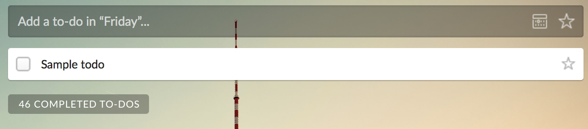
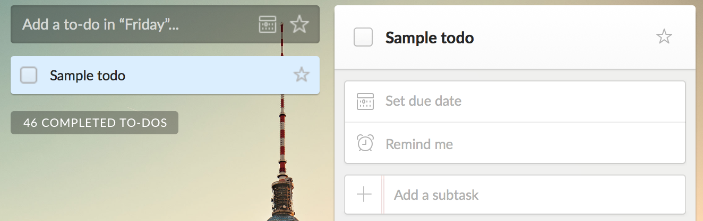

# Todo List App (for learning Vue.JS)

## Objectives
This app will take students through a basic web-based todo list application (already implemented without javascript, meaning new pages are rendered when something is added to the list, edited, or deleted) and convert it to a dynamically updating application running on Vue.JS to support basic CRUD operations of manipulating todo list items.

The goals for this lab are to:

1. Introduce students to the Vue.JS framework and basic Vue.JS syntax.
2. Give students an experience adding dynamic front-end effects to a completed web application.
3. Introduce general techniques for debugging Vue.JS.
4. Walk students through adding dynamic feedback to showcase front-end changes.
5. Help students identify opportunities to add dynamic effects to applications.

### Part 1: Introduction to Vue.JS
While students will certainly have a chance to learn the basics of Vue.JS through an introductory lecture, perhaps it is worth preparing a brief recap of Vue.JS?

Regardless, it should be worth noting the documentation for Vue.JS can be found [here](https://vuejs.org/v2/guide/).

### Part 2: Walking Through the To-do List Application
At this point, we will have students clone a working To-do list application which has poor user experience, considering every action redirects a user to another page, making the overall process slow and inefficient. It works (and runs in Rails 5!), but uses no javascript to modify elements.

**Note that at this point the reviewing application is a relatively barebones Rails application** (with minimal CSS to help students focus on the content, informational flow, and UX).

The following functionalities would be supported:
1. Adding an item to a to-do list (title, description, due date)
2. Editing an item on a to-do list
3. Removing an item from a to-do list
4. Marking an item on a to-do list as complete
5. Marking a completed item on a to-do list as incomplete

Here, students will perform some steps to get used to the application and explore the pain of not using javascript to perform actions. They can do some exercises in performing basic to-do list item CRUD operations.

## Checkpoint 1
The TAs will look to see that the students have:
1. Gotten the Rails 5 application up and running.
2. Added a new to-do item.
3. Edited an existing to-do item.
4. Deleted an existing to-do item.
5. Marked a to-do list item as complete.

Again, this is a basic walkthrough of a to-do list application. The main point is to highlight pain points in UX raised without ample javascript-supporting interactions.

### Part 3: Identifying Slowdowns and Pain Points of the Reviewing Application
Here, students will have an opportunity to explore the existing (static) functionality of the reviewing application in order to identify areas of improvement using Vue.JS. Hopefully, they picked up on these pain points while doing a walkthrough of the application (part 2). This section will just further point slowdowns and UX problems which can be addressed using Vue, and how these can be better remedied, setting the stage for making changes.

This section will walk through why browser refreshes hinder the experience of using the to-do list application for relatively quick sections of the application, including:
1. Adding a new to-do list item.
2. Editing an existing to-do list item.
3. Marking a to-do list item as complete or incomplete.
(Note: I propose leaving out deleting a to-do list item using Vue as another exercise due to time constraints).

### Part 4: Adding a To-do List Item in Vue
**Note: the vision for a to-do list design mimics a simplified Wunderlist app. (Adding is a simple text input, checkboxes for marking complete, etc.)**

This is the first part of the lab in which students will modify the existing experience of adding a review of a store (which exists by redirecting to another page) to run through Vue without redirecting screens.

Students will have to save the review using Rails/Vue to the DB.

The goals of this section are:
1. To convert an existing HTML form to be run through Vue.
2. To get experience saving data through Vue.
3. To consider multiple parts of an application which must be manipulated with Vue upon an interaction occurring (such as adding an overall list on submitting a new to-do).

## Checkpoint 2
The TAs will look to see that the students have:
1. Modified the form so that no new page is rendered at any step of adding a to-do list item.
2. Created a form which dynamically updates the front-end upon creating a to-do list item (have them post one).
3. Posted new to-do list items so that they are indeed saved to the database (refresh the page).
4. Adding a new item changes other view data on the page.

### Part 5: Editing a To-do List Item
The vision for editing a to-do list item is based again off of Wudnerlist:

Students will here modify the existing application to allow for use of Vue to edit the details of an existing to-do list item.

### Part 6: Marking as Complete/Incomplete
Continuing off of the Wunderlist design, students will add checkboxes and input the needed Vue tools to mark a to-do as complete or incomplete, and update the view accordingly.

## Checkpoint 3
The TAs will look to see that the students have:
1. Modified the form so that no new page is rendered at any step of editing a to-do list item.
2. Created a form which dynamically updates the front-end upon editing a to-do list item (have them edit).
3. Posted changed to-do list items so that they are indeed saved to the database (refresh the page).
4. Editing a to-do list item changes the view as expected.
5. To-do list items can be marked as complete or incomplete, with appropriate visual changes to the view, and is retained in the DB.

## Bonus Material
Upon completing the lab, students can work on deleting to-do list items using Vue.

